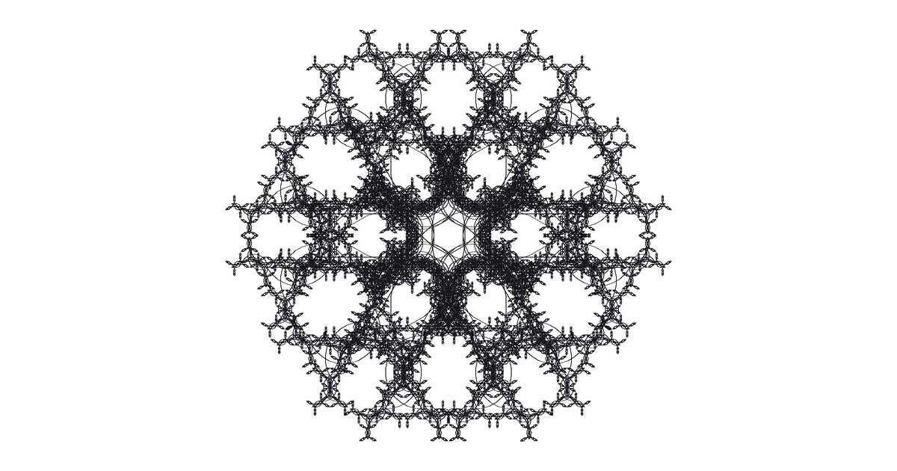
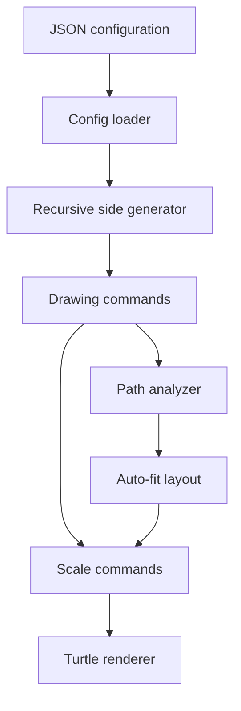

<div align="center">

  <h3>Recursive Geometry&nbsp;·&nbsp;Generative Systems&nbsp;·&nbsp;Computational Art</h3>

  <p>
    A configuration-driven Python system that transforms one geometric side<br />
    into intricate polygonal fractals composed of lines, turns, and circular arcs.
  </p>

  <p>
    <a href="#overview"><strong>Overview</strong></a>
    &nbsp;·&nbsp;
    <a href="#generated-output"><strong>Output</strong></a>
    &nbsp;·&nbsp;
    <a href="#how-it-works"><strong>How It Works</strong></a>
    &nbsp;·&nbsp;
    <a href="#configuration"><strong>Configuration</strong></a>
    &nbsp;·&nbsp;
    <a href="#running-locally"><strong>Run Locally</strong></a>
    &nbsp;·&nbsp;
    <a href="#project-architecture"><strong>Architecture</strong></a>
  </p>

</div>

<br />

## Overview

**PuzzleFractals** is a generative-geometry application that builds regular polygons from recursively defined sides. Instead of hard-coding one drawing sequence, the project describes each side as a compact production rule containing recursive calls, forward movements, rotations, and arcs.

The refactored system separates fractal generation from rendering. It first produces a stream of immutable drawing commands, analyzes the complete path, calculates an automatic scale and starting position, and finally renders the centered result with Python Turtle.

<br />

<div align="center">

| Project Type | Output | Runtime | Configuration | License |
| :---: | :---: | :---: | :---: | :---: |
| Generative graphics system | Turtle canvas | Python 3.10+ | JSON | MIT |

</div>

<br />

## Generated Output

The image below is generated from the current `configs/puzzle_default.json` configuration.

<div align="center">

  

  <br />

  <sub><strong>6 polygon sides · recursion depth 5 · 46,656 drawing commands</strong></sub>

</div>

The default recursive rule expands into:

| Command | Generated count |
| :--- | ---: |
| `Forward` | 18,660 |
| `Turn` | 18,666 |
| `Arc` | 9,330 |
| **Total** | **46,656** |

These figures were calculated directly from the current generator and default configuration.

<br />

## How It Works

| Stage | Current component | Responsibility |
| :--- | :--- | :--- |
| 01 · Load | `PuzzleFractalConfigLoader` | Reads the JSON configuration, validates its fields, and converts its operations into typed rules. |
| 02 · Expand | `PuzzleFractalSideGenerator` | Recursively expands one side pattern into drawing commands. |
| 03 · Close | `PuzzleFractal` | Repeats the generated side around a regular polygon and corrects its net rotation. |
| 04 · Analyze | `PathAnalyzer` | Calculates the complete bounds of forward segments and circular arcs. |
| 05 · Fit | `AutoFitLayout` | Determines the scale and start position required to center the geometry inside the canvas. |
| 06 · Transform | `scale_commands()` | Scales every distance-based command while preserving turns. |
| 07 · Render | `TurtleRenderer` | Interprets the command stream through Python Turtle and displays the final composition. |



The generator and renderer communicate through three drawing primitives:

```python
DrawingCommand = Forward | Turn | Arc
```

This boundary keeps the mathematical construction independent from the technology used to display it.

<br />

## Configuration

The current fractal is defined by `configs/puzzle_default.json`:

```json
{
    "id": "7f83b1657ff14dcab7528c7a96f3c8d9",
    "side_count": 6,
    "recursion_depth": 5,
    "base_side_length": 500.0,
    "scale_factor": 2.718281828,
    "operations": [
        ["recursive_side"],
        ["forward", 1.0],
        ["recursive_side"],
        ["turn_right", 120.0],
        ["recursive_side"],
        ["arc", 1.0, 180.0],
        ["recursive_side"],
        ["turn_right", 120.0],
        ["recursive_side"],
        ["forward", 1.0],
        ["recursive_side"]
    ]
}
```

### Main parameters

| Field | Current value | Purpose |
| :--- | :---: | :--- |
| `id` | `7f83...c8d9` | Identifies the configuration. |
| `side_count` | `6` | Repeats the fractal side around a six-sided polygon. |
| `recursion_depth` | `5` | Controls how many times the side rule expands into itself. |
| `base_side_length` | `500.0` | Defines the initial, unscaled side length. |
| `scale_factor` | `2.718281828` | Reduces the side length at every recursive level. |
| `operations` | `11 rules` | Defines the ordered production rule for one side. |

### Rule vocabulary

| JSON rule | Arguments | Generated behavior |
| :--- | :--- | :--- |
| `["recursive_side"]` | None | Expands the complete side rule at the next recursion level. |
| `["forward", length_factor]` | Positive length factor | Produces a `Forward` command relative to the scaled side length. |
| `["turn_left", angle]` | Angle in degrees | Produces a left `Turn`. |
| `["turn_right", angle]` | Angle in degrees | Produces a right `Turn`. |
| `["arc", radius_factor, angle]` | Non-zero radius factor and angle | Produces a circular `Arc` relative to the scaled side length. |

The loader rejects missing fields, malformed operations, unsupported rule names, non-finite numbers, and invalid configuration values before generation begins.

<br />

## Running Locally

PuzzleFractals uses the Python standard library and does not require third-party packages. Python must include Tk support because Turtle renders through Tkinter.

### Requirements

- Python 3.10 or newer
- Tkinter / Turtle support
- Git
- A desktop environment capable of opening a graphical window

### Clone the repository

```bash
git clone https://github.com/3ConstArt3/PuzzleFractals.git
cd PuzzleFractals
```

The current imports treat `src/fractal_research` as the source root.

#### Windows PowerShell

```powershell
$env:PYTHONPATH = "src/fractal_research"
python main.py
```

#### Windows Command Prompt

```batch
set PYTHONPATH=src\fractal_research
python main.py
```

#### macOS / Linux

```bash
PYTHONPATH=src/fractal_research python3 main.py
```

In PyCharm, mark `src/fractal_research` as **Sources Root** and run `main.py`.

The Turtle window remains open until the canvas is clicked.

<br />

## Programmatic Generation

The current generator can be used without opening the Turtle renderer:

```python
from pathlib import Path

from config.loader import PuzzleFractalConfigLoader
from fractals.puzzle.puzzle_fractal import PuzzleFractal


config = PuzzleFractalConfigLoader.load(
    Path("configs/puzzle_default.json")
)

commands = list(
    PuzzleFractal(config).generate()
)

print(len(commands))  # 46656
```

Run the example with the same source-root configuration described above.

<br />

## Project Architecture

```text
PuzzleFractals/
├── configs/
│   └── puzzle_default.json
├── src/
│   └── fractal_research/
│       ├── analysis/
│       │   └── path_analyzer.py
│       ├── config/
│       │   ├── errors.py
│       │   ├── loader.py
│       │   └── settings.py
│       ├── core/
│       │   ├── drawing_commands.py
│       │   ├── drawing_transforms.py
│       │   ├── geometry.py
│       │   └── identifiers.py
│       ├── fractals/
│       │   └── puzzle/
│       │       ├── puzzle_fractal.py
│       │       ├── side_generator.py
│       │       └── side_pattern.py
│       ├── layout/
│       │   └── auto_fit_layout.py
│       ├── rendering/
│       │   ├── renderer.py
│       │   └── turtle_renderer.py
│       └── application.py
├── LICENSE
├── README.md
├── Snippets.txt
└── main.py
```

The architecture separates the recursive grammar, geometry, path analysis, layout, and rendering. This allows the same fractal generator to support different visual backends without embedding Turtle operations inside its mathematical logic.

`Snippets.txt` preserves earlier pattern experiments as a research archive and is not part of the runtime application flow.

<br />

## Design Decisions

- **Declarative recursion:** the side pattern lives in JSON instead of being embedded in procedural drawing code.
- **Typed rule model:** `RecursiveSide`, `ForwardRule`, `TurnRule`, and `ArcRule` form the `SideRule` type alias.
- **Immutable commands:** drawing instructions and geometry values use frozen, slotted data classes.
- **Generator-based construction:** recursive sides yield commands lazily rather than drawing directly.
- **Renderer independence:** the abstract `Renderer` interface separates generation from presentation.
- **Automatic composition:** `PathAnalyzer` and `AutoFitLayout` scale and center each generated path inside the configured canvas.
- **Rotation correction:** the polygon accounts for the recursive side's net heading change before joining the next side.

<br />

## Rendering Defaults

The current `ApplicationConfig` uses the following canvas and Turtle settings:

| Setting | Default |
| :--- | :---: |
| Canvas size | `1200 × 630` |
| Canvas padding | `40` |
| Window title | `Puzzle Fractal` |
| Background | `white` |
| Pen size | `1` |
| Turtle speed / delay | `0 / 0` |
| Cursor | Hidden |
| Animation | Disabled |

<br />

## Future Direction

The current refactor establishes a reusable foundation for additional fractal configurations and rendering strategies. Possible next steps include configuration selection at launch, export-oriented renderers, and a visual editor for composing recursive side patterns.

These directions are planned extensions and are not presented as implemented features.

<br />

## Contributing

Contributions, new side patterns, rendering experiments, and architecture improvements are welcome. You can open an issue or submit a pull request with a clear explanation of the proposed change.

<br />

## License

PuzzleFractals is available under the [MIT License](./LICENSE).

<br />

<div align="center">

  <p><em>Designed and developed by <a href="https://github.com/3ConstArt3"><strong>ConstArt</strong></a></em></p>
  <br />

</div>
